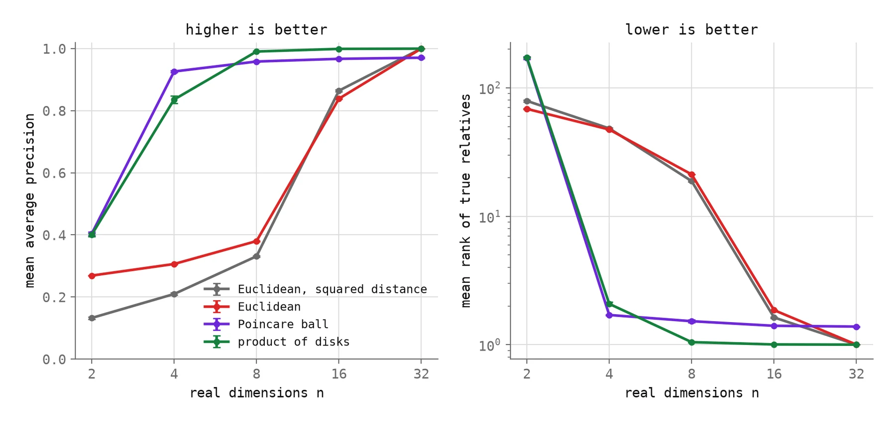
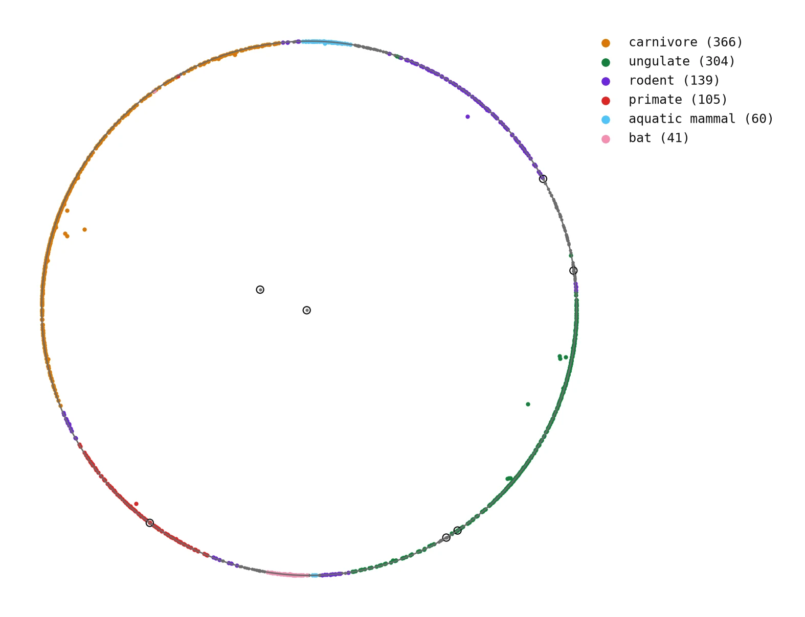
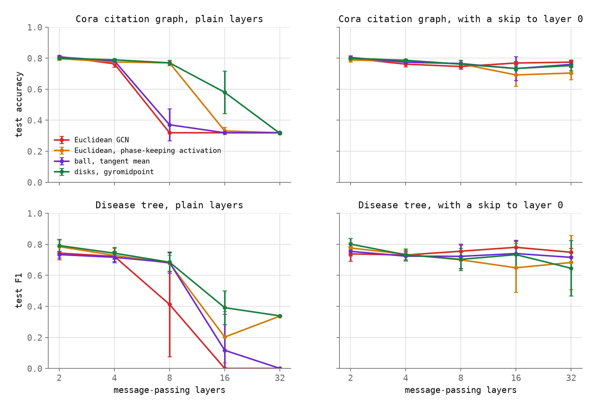

# escaping-flatland

Does storing hierarchical memory in hyperbolic space help? This repository builds a "hyperbolic context manifold", a product of Poincare disks with complex coordinates, in a way where every operation is well defined, and then tests what it is claimed to do.

It is the code behind the essay **Escaping Flatland**:
[paper-style version](https://nsquaredzz.github.io/blog/escaping-flatland/) · [comic-style version](https://blog-one-xi-62.vercel.app/issues/escaping-flatland).

Short answer: **curved space bought capacity. It did not buy depth.**

<picture>
  <source media="(prefers-color-scheme: dark)" srcset="figures/dark/e1-capacity.webp">
  
</picture>

## Results

Three experiments. All numbers are means over 5 seeds and come from the files in `results/`.

### 1. How much hierarchy fits in n dimensions?

Reconstruction of the WordNet mammal hierarchy (1,170 synsets, 6,448 ancestor pairs), the protocol of Nickel and Kiela (2017). Mean average precision, higher is better.

| real dimensions | Euclidean | Poincare ball | product of disks |
|---|---|---|---|
| 2 | 0.269 ± 0.001 | **0.403 ± 0.006** | 0.400 ± 0.005 |
| 4 | 0.306 ± 0.002 | **0.926 ± 0.003** | 0.836 ± 0.012 |
| 8 | 0.380 ± 0.001 | 0.958 ± 0.003 | **0.990 ± 0.001** |
| 16 | 0.838 ± 0.001 | 0.967 ± 0.002 | **0.999 ± 0.000** |
| 32 | **1.000 ± 0.000** | 0.970 ± 0.002 | **1.000 ± 0.000** |

With 8 real dimensions the curved spaces keep a hierarchy that flat space loses. Flat space catches up at 32. In a product of 8 disks, the **phase** of a node identifies which branch it belongs to 99.9 % of the time by nearest neighbour, against 65.2 % from magnitudes. Magnitude does not encode depth: the root sits at the centre, and everything else sits near the rim whatever its depth.

<picture>
  <source media="(prefers-color-scheme: dark)" srcset="figures/dark/e1-disk.webp">
  
</picture>

### 2. Does the geometry stop over-smoothing?

No. Node classification on Cora with 2 to 32 message-passing layers, test accuracy. 0.319 is the score of always predicting the largest class.

| network | layers | 2 | 4 | 8 | 16 | 32 |
|---|---|---|---|---|---|---|
| Euclidean GCN | plain | 0.810 | 0.764 | 0.319 | 0.319 | 0.319 |
| Euclidean, phase-keeping activation | plain | 0.797 | 0.775 | 0.769 | 0.331 | 0.319 |
| Poincare ball, tangent mean | plain | 0.807 | 0.783 | 0.371 | 0.319 | 0.319 |
| product of disks, gyromidpoint | plain | 0.799 | 0.789 | 0.770 | 0.580 | 0.315 |
| Euclidean GCN | with skip | 0.799 | 0.761 | 0.746 | 0.768 | 0.774 |
| Euclidean, phase-keeping activation | with skip | 0.788 | 0.780 | 0.763 | 0.692 | 0.704 |
| Poincare ball, tangent mean | with skip | 0.804 | 0.774 | 0.765 | 0.733 | 0.760 |
| product of disks, gyromidpoint | with skip | 0.799 | 0.786 | 0.761 | 0.733 | 0.752 |

- Every plain network collapses by 32 layers, in every geometry.
- The disks network lasts to 8 layers, but so does a flat network given the same activation. The curvature is not what helps.
- A skip connection to layer 0 fixes depth for all four.
- With no weights at all, the hyperbolic midpoint shrinks the spread between nodes at least as fast as the ordinary mean.

<picture>
  <source media="(prefers-color-scheme: dark)" srcset="figures/dark/e2-depth.webp">
  
</picture>

### 3. The whole pipeline on a tree

Complex lift, message passing and a contrastive loss on distance, used for link prediction on the Disease tree (2,665 nodes). Test AUC.

| network | 1 layer | 2 layers | 4 layers |
|---|---|---|---|
| Euclidean GCN | 0.971 ± 0.008 | 0.750 ± 0.030 | 0.735 ± 0.019 |
| Euclidean, phase-keeping activation | 0.971 ± 0.008 | 0.787 ± 0.025 | 0.786 ± 0.032 |
| Poincare ball, tangent mean | **0.992 ± 0.003** | **0.989 ± 0.003** | **0.957 ± 0.016** |
| product of disks, gyromidpoint | 0.985 ± 0.006 | 0.962 ± 0.011 | 0.941 ± 0.014 |

Both hyperbolic pipelines work at every depth. The flat one is close with one layer and far behind with more. The ordinary Poincare ball is at least as good as the product of disks.

## What is new, what is not, what is missing

**Not new.** Poincare embeddings (Nickel and Kiela 2017), hyperbolic networks (Ganea et al. 2018), hyperbolic graph networks (Chami et al. 2019; Liu et al. 2019), product manifolds (Gu et al. 2019), the Einstein midpoint for aggregation (Ungar 2008; Gulcehre et al. 2019; Shimizu et al. 2021), relation as rotation of phase (Sun et al. 2019; Chami et al. 2020), over-smoothing and its fix by residual connections (Li et al. 2018; Chen et al. 2020), also in hyperbolic networks (Liu et al. 2024). Full references are in the essay.

**What this adds.** One consistent construction around complex coordinates, a test for each mathematical statement it relies on, and measurements of what the construction is claimed to do, including the claims that turned out to be false.

**Missing.**
- Scale: every graph here has between 1,044 and 2,708 nodes.
- No retrieval benchmark on text, which is the motivation for the idea.
- No typed relations ("supports", "causes", "depends on").
- Fixed curvature of -1, and a plain optimiser (Adam on tangent coordinates).
- One configuration per dataset in experiments 2 and 3, not tuned per model.
- The product of disks never clearly beat the ordinary Poincare ball, so the part of the design that is specific to this project has no measured advantage yet.

## Layout

```
flatland/geom.py      Euclid, Poincare ball and product of disks: exp0, log0, distance,
                      Mobius addition, the complex lift, the gyromidpoint
flatland/models.py    four message-passing networks of equal width: Euclidean GCN, Poincare ball
                      (HGCN style), product of disks, and a flat control with the disks' activation
flatland/data.py      WordNet mammals, Cora, Disease. Downloaded on first use, never committed
e1_hierarchy.py       experiment 1
e2_oversmoothing.py   experiment 2
e3_linkpred.py        experiment 3
make_tables.py        every table in the essay, printed as markdown from results/*.json
make_figures.py       every figure in the essay, from results/*.json and closed-form geometry
tests/                18 tests: each statement the essay makes about the geometry, and the networks
results/              e1.json, e2.json, e3.json, e1_embeddings.npz
figures/              the figures, in a dark and a light theme
```

## Run it

```bash
python3.12 -m venv .venv
.venv/bin/pip install -r requirements.txt
.venv/bin/python -m pytest tests -q          # 18 tests, a few seconds
.venv/bin/python e1_hierarchy.py             # about 30 minutes on a 10-core laptop
.venv/bin/python e2_oversmoothing.py         # about 25 minutes
.venv/bin/python e3_linkpred.py              # about 5 minutes
.venv/bin/python make_tables.py              # the tables above and in the essay
.venv/bin/python make_figures.py             # figures/dark, add --light for figures/light
```

Everything runs on CPU, one thread per run, with the seeds fixed in the scripts. `--quick` runs a small version of any experiment in a minute or two.

## Protocol

**Experiment 1.** Each synset is a free point. Spaces at equal real dimension: Euclidean (distance and squared distance), the Poincare ball, and a product of Poincare disks. Loss: softmax over 10 sampled negatives on negative distance. Mini-batches of 2,048 pairs, 4,000 steps of Adam. The learning rate is chosen per space and dimension from five values on seed 0 by the reconstruction score itself, since reconstruction has no held-out set, then five seeds are run. Two checks use four times the budget.

**Experiment 2.** Part A repeats one neighbour-averaging step with no weights. Part B trains four networks, 32 real dimensions wide, on Cora (public Planetoid split) and on the Disease tree (30/10/60 splits), with 2, 4, 8, 16 and 32 layers, with and without a skip connection to layer 0. One configuration per dataset, fixed in advance and identical for all models. 400 runs.

**Experiment 3.** 85/5/10 edge split with sampled non-edges, held-out pairs scored by negative distance, 16 real dimensions, 1, 2 and 4 layers. The flat one-layer model is also run without an epoch limit to confirm it had converged.

## Data and credit

- WordNet 3.0 (Princeton University), through NLTK.
- Cora with the Planetoid split, from the [planetoid](https://github.com/kimiyoung/planetoid) repository (Sen et al. 2008; Yang et al. 2016).
- The Disease graphs, from the [hgcn](https://github.com/HazyResearch/hgcn) repository of Chami et al. (2019).

No dataset is stored in this repository. Each is downloaded into `data/` the first time it is used.

## License

MIT. See [LICENSE](LICENSE).
